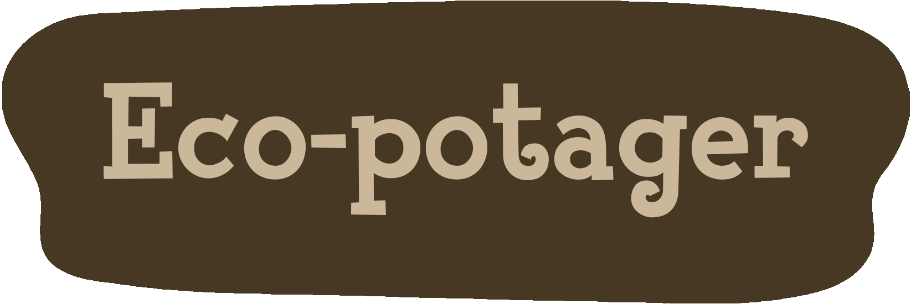
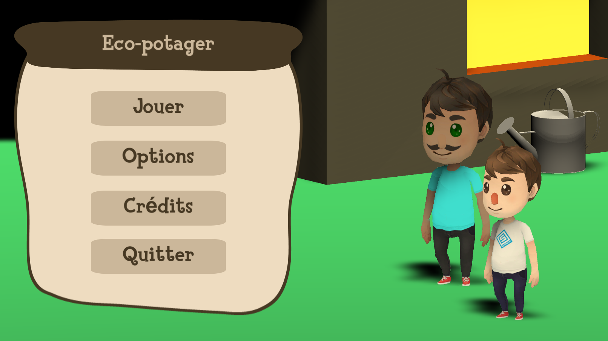
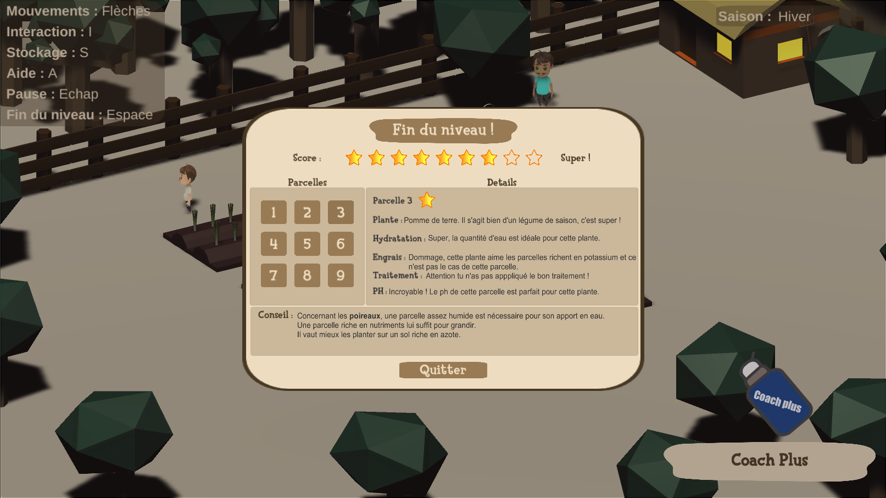

Serious game dans le cadre de l'UE M1IF28 - Logiciel Educatif (UCBL 1) sur le thème de la sensibilisation à l'écologie via la découverte de la physique et la chimie, à travers la gestion d'un potager éco responsable.

# Le jeu

Eco-potager se pose comme un puzzle game dans lequel le joueur doit aider son oncle Robert à garder une ferme écologique et responsable de l'environnement. Celui-ci doit faire face à une suite d'énigme où il apprend et applique des bonnes pratiques de jardinage. À chaque niveau le joueur dispose d'un nombre défini de parcelles avec des conditions spécifiques et doit s'adapter à son environnement afin de choisir les bonnes graines à planter et leur apporter l'eau, les nutriments ainsi que le traitement contre les insectes nécessaires. L'oncle Robert sera disponible à chaque niveau afin de donner des conseils et suivre la progression du joueur en proposant à chaque fin de niveau un récapitulatif des plantations du joueur lui indiquant ses réussites et ses erreurs.

# Exécutable

Afin de pouvoir lancer l'application il est nécessaire de cloner ce projet et de lancer l'exécutable ``_BUILD/Eco-potager.exe ``

# Technologies et assets

* Réalisé sous **Unity 2019.3.0f6**.
* Personnage : [Character Pack: Free Sample](https://assetstore.unity.com/packages/3d/characters/humanoids/character-pack-free-sample-79870?fbclid=IwAR0E5x9gwmFjXKEL1iSWbPo1StEmyd4_JI31vWVdAQepPBbwnMJGzT-KgoM)
* Environnement : [Low Poly Middle Ages Village](https://assetstore.unity.com/packages/3d/environments/historic/low-poly-middle-ages-village-141446?fbclid=IwAR1ps4Ow3GGe4T-95WYrmFJ4G7LvPgYrTdC1nPk9v5GKEsRWIpMH9R5MQ1c)

# Développeurs

* GIVORD Lucas
* IDOUX Etienne
* ROBERT Nicolas

